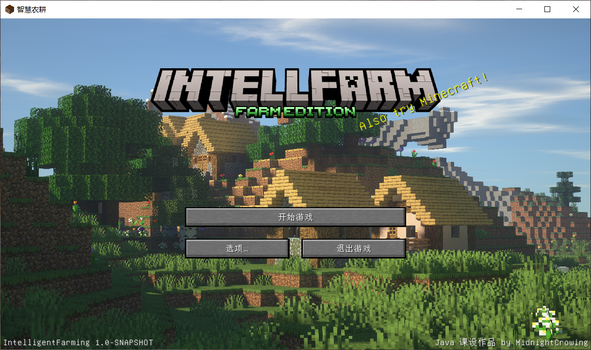
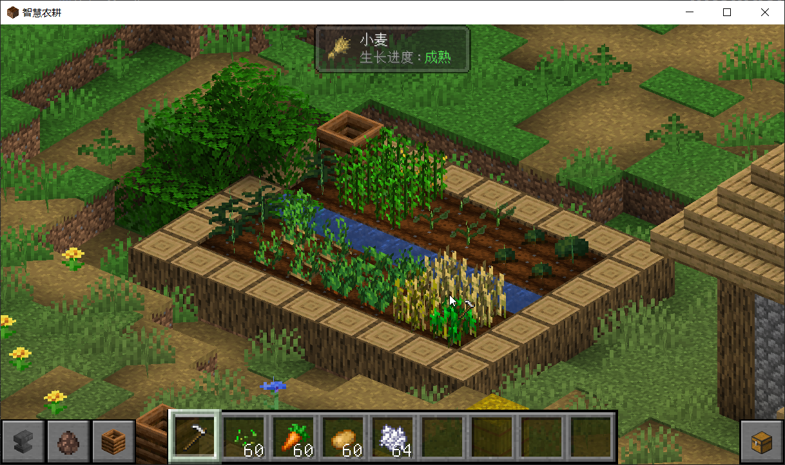
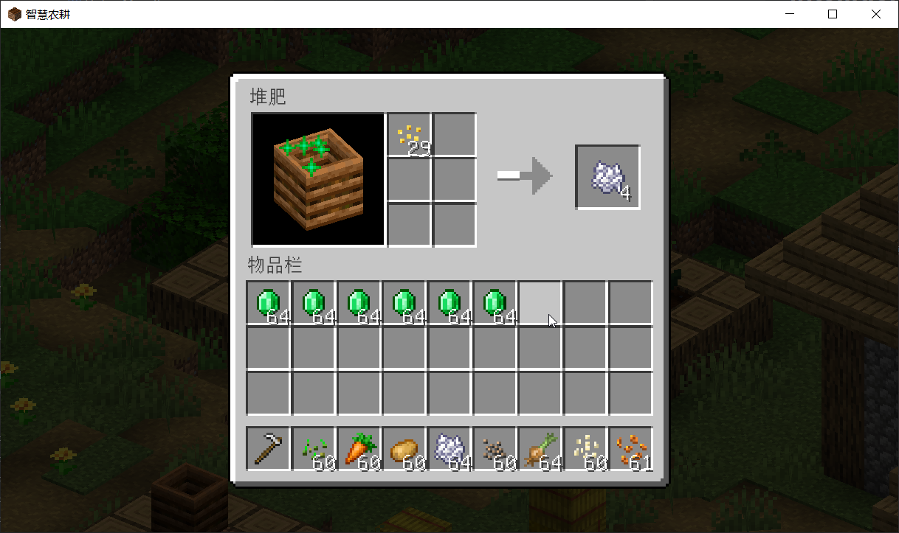

# IntelligentFarming

## 🌾 简介

// TODO

## 📸 游戏截图

  <table style="border-spacing: 12px 6px; text-align: center;">
    <tr>
      <td></td>
      <td></td>
      <td></td>
    </tr>
    <tr>
      <td>主界面</td>
      <td>农田场景</td>
      <td>堆肥桶界面</td>
    </tr>
  </table>

## 📜 许可证

本项目采用 [MIT 许可证](LICENSE) 进行授权，您可以自由使用、修改和分发本项目的代码。

如果您进行二次发布或修改后的分发，请务必保留原作者署名。

感谢您的理解与尊重！

## ✨ 致谢

本项目使用了 Minecraft 原版中的部分资源，感谢 Mojang 带来的灵感和素材支持。

另外，还使用了以下模组中的资源和内容：

- [Farmer's Delight](https://www.curseforge.com/minecraft/mc-mods/farmers-delight)
- [Corn Delight](https://www.curseforge.com/minecraft/mc-mods/corn-delight)
- [Cotton](https://modrinth.com/mod/cotton)

特别感谢以下工具的帮助：

- 正交视图由模组 [Isometric Renders](https://www.curseforge.com/minecraft/mc-mods/isometric-renders) 生成
- 游戏主界面标题由 [Blockbench](https://blockbench.net/) 制作

背景图片来源于公开网络壁纸资源：

- 主界面背景：https://wall.alphacoders.com/big.php?i=1117617
- 设置界面背景：https://wallhere.com/zh/wallpaper/2220848

感谢开源社区以及所有为该项目做出贡献的开发者！
