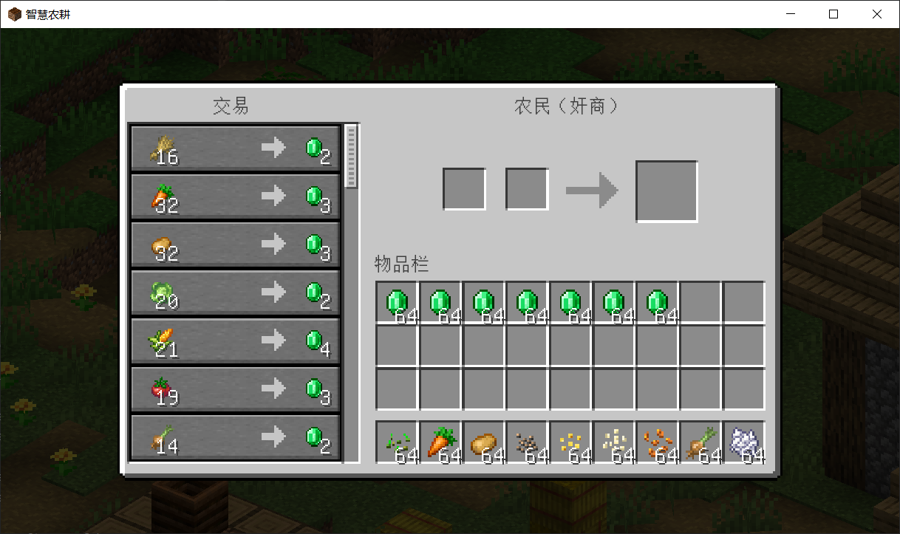

<p align="center">

</p>

# IntelligentFarming


## 🌾 简介

**IntelligentFarming（智慧农耕）** 是一款使用 LWJGL 开发的轻量级像素风模拟游戏，作为 Java
课程设计项目的一部分，灵感来源于《Minecraft》的种田玩法。玩家可以在游戏中体验播种、收获、资源管理等农业活动，并通过交易与堆肥系统，逐步建设属于自己的小型农场。

**⚠️ 本游戏并非 Minecraft 或 Mojang 官方产品，也未获得其认可或关联，仅为个人学习用途开发的项目。**

> [!IMPORTANT]
> 本项目为独立开发的小游戏，并非 Minecraft 模组。重点在于基本玩法还原与功能实现，仅作为学习和参考项目。

### 🎮 玩法特色

- **经典耕作循环**：种植小麦、胡萝卜等基础作物，成熟后可收割并获得产出与种子
- **模组作物拓展**：引入玉米、棉花等作物（素材来源于 MC 模组）
- **辅助工具系统**：可使用骨粉加速作物生长，部分工具具备时运效果
- **堆肥机制**：将作物废料投入堆肥桶，转化为骨粉资源
- **基础交易功能**：与村民交易以获取种子、工具等物品

## 📸 游戏截图

<div style="overflow-x: auto;">
  <table style="text-align: center; border-spacing: 12px 6px; min-width: 700px;">
    <tr>
      <td></td>
      <td></td>
      <td></td>
      <td></td>
    </tr>
    <tr>
      <td>主界面</td>
      <td>农田场景</td>
      <td>农作物交易</td>
      <td>堆肥桶界面</td>
    </tr>
  </table>
</div>

## 🖥️ 运行环境

- 需要 Java 21 或更高版本

## 📦 安装与运行

从 [Releases 页面](https://github.com/MidnightCrowing/IntelligentFarming/releases) 下载最新版本的 JAR 文件：

- 双击 JAR 文件即可启动游戏
- 或在命令行中运行以下命令（将 `<version>` 替换为你下载的版本号）：

  ```bash
  java -jar IntelligentFarming-<version>.jar
  ```

## 📜 许可证

本项目采用 [MIT 许可证](LICENSE) 进行授权，**该许可仅适用于本项目的源代码部分**。

您可以自由使用、修改和分发本项目的代码，若进行二次发布或修改分发，请务必保留原作者署名。

⚠️ 请注意：

- 本项目包含部分素材（如贴图、音效、背景音乐）来自 Minecraft，其版权归 Mojang 所有，仅用于非商业、学习目的。
- 若您希望在其他项目中使用这些素材，**需自行确保符合 Mojang 的版权政策**。
- 若因素材使用违反相关政策而产生任何后果，本游戏开发者不承担任何责任。

感谢您的理解与尊重！

## 🤝 贡献者

感谢以下开发者为本项目的贡献：

- [StevenArai](https://github.com/StevenArai)

## ✨ 致谢

本项目使用了部分来自《Minecraft》的原版资源（包括贴图、音效等），仅用于学习目的。特此致谢 Mojang 带来的灵感与素材支持。

本游戏中的背景音乐为 **C418** 创作的 **《Sweden》**，版权所有归 C418 所有，用于本项目仅作展示和非商业用途，谨以此表达敬意与感谢。

另外，还使用了以下模组中的资源和内容：

- [Farmer's Delight](https://www.curseforge.com/minecraft/mc-mods/farmers-delight)
- [Corn Delight](https://www.curseforge.com/minecraft/mc-mods/corn-delight)
- [Cotton](https://modrinth.com/mod/cotton)

特别感谢以下工具的帮助：

- 正交视图由模组 [Isometric Renders](https://www.curseforge.com/minecraft/mc-mods/isometric-renders) 生成
- 游戏主界面标题由 [Blockbench](https://blockbench.net/) 制作

背景图片来源于以下公开壁纸资源：

- 主界面背景：https://wall.alphacoders.com/big.php?i=1117617
- 设置界面背景：https://wallhere.com/zh/wallpaper/2220848

感谢开源社区以及所有为该项目做出贡献的开发者！
